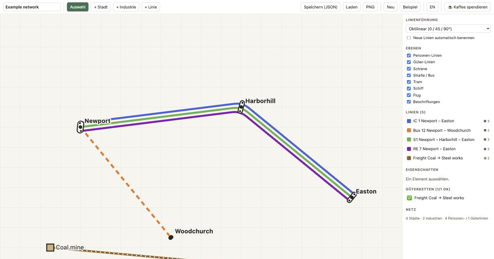

# LineDraft

A free, schematic (metro-style, not to scale) network line planner for
sandbox-mode tycoon games. Place cities and industries, draw passenger and
cargo lines across rail/road/tram/ship/air, label everything, toggle layers —
plan the whole network before you build a single piece of track.

**Live app:** https://linedraft.bryglab.io



No server, no cloud, no account. Everything runs client-side in the browser,
with autosave to `localStorage` and JSON import/export plus PNG export for
sharing a plan.

## Features

- Pan/zoom SVG canvas with a grid
- Place, name, move and delete cities and industries
- Multi-stop lines per mode (rail, road, tram, ship, air), passenger or cargo,
  freely colorable
- Automatic parallel-line bundling on shared track segments: rounded corners,
  white casing between lines, station markers per node (capsule = interchange,
  bar = single stop), slot ordering chosen so branching lines avoid crossing
  the rest of the bundle
- Optional octilinear routing (0°/45°/90°), like a real subway diagram, vs.
  direct/straight routing
- Waypoints/detours per line (drag a dashed segment handle) without affecting
  other lines on the same corridor
- Manually draggable platforms per line at a station, with reset
- Distinct line style per mode (solid rail, thin tram, dashed road, dotted
  ship, dash-dot air); cargo lines get an extra light hatch over their color
- Industries have a role (producer / consumer / both); a cargo-chain check in
  the sidebar flags cargo lines whose source doesn't produce or whose
  destination doesn't consume what's being hauled
- Auto line naming from the stops/mode pattern, with a manual override
- Layer toggles (passenger / cargo / per mode / labels) plus a legend
- Local autosave, JSON import/export (`.tfld.json`), PNG export
- Bilingual UI, English/German, auto-detected from the browser and
  remembered (switch top-right)

Some features exist in the codebase but are behind disabled flags in
`src/types.ts` (corridors/road layer, warehouse nodes, line priority, cargo
categories) — set the relevant flag to `true` to turn them back on.

## Controls

| Action | How |
|---|---|
| Pan | drag empty canvas · **space + drag** (anywhere) · middle/right mouse button · **shift + wheel** (horizontal) |
| Zoom | mouse wheel / pinch (toward cursor) · **+ / −** keys · buttons bottom-right |
| Fit to content | ⤢ button or **0** key (also runs automatically on load) |
| Zoom feels backwards? | **⇅** button bottom-right flips scroll direction (remembered) |
| Place a city / industry | pick the tool, click the canvas |
| Move a node | drag it in the "Select" tool |
| Draw a line | "+ Line", click nodes in order, **Enter** or click on empty space to finish |
| Edit a line's stops | select the line → "click / append a stop" |
| Edit properties | click an element → right-hand panel |
| Move a line's platform | select the line → drag the white stop handle on the map (double-click to reset) |
| Insert a waypoint / detour | select the line → drag the dashed segment handle (midpoint) onto the map. Affects only that line, isn't a stop. Remove it from the waypoint bar. |

## Tech stack

Vite + React + TypeScript, hand-rolled SVG rendering, Zustand for state. No
runtime dependency on any game — this is purely a planning aid that produces
JSON/PNG you keep for reference.

## Getting started

```bash
npm install
npm run dev      # http://localhost:5173 (or the next free port)
npm run build    # dist/index.html + dist/assets/*.{js,css}
npm run preview  # serve the production build locally
```

The production build is a normal static site (hashed JS/CSS assets next to
`index.html`) — deploy the `dist/` folder to any static host. It needs to be
served over `http(s)`; opening `dist/index.html` directly via `file://` won't
work due to browser module-loading restrictions.

## Feedback

This is a solo side project and still beta. Bug reports and feature requests:
https://github.com/bryglab/linedraft/issues

## Status

Roadmap and implementation notes: [PROJECT.md](PROJECT.md).

## License

[MIT](LICENSE)
